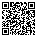

# luau-qrgen

QR code generation for Lune and Roblox.

Documentation: [https://pnlmon.github.io/luau-qrgen/](https://pnlmon.github.io/luau-qrgen/)

[](https://github.com/pnlmon/luau-qrgen/actions/workflows/ci.yml)

## Features

- QR Code Model 2 spec (versions 1-40)
- Error correction levels L, M, Q, H
- Numeric, Alphanumeric, Byte, Kanji, ECI modes
- Auto mode selection
- Strict typing
- Roblox Frame renderer with greedy row batching
- SVG output

## Install

```bash
pesde add luau_qrgen/qrgen
```

## Usage

### Basic Usage

```luau
local qrgen = require("@packages/qrgen")

local qr = qrgen.encodeText("Hello, World!", qrgen.ecc.medium)

print("Size:", qr.size)

for y = 0, qr.size - 1 do
    for x = 0, qr.size - 1 do
        local isDark = qr:getModule(x, y)
    end
end
```

### Segments

```luau
local segs = {
    qrgen.segment.makeAlphanumeric("HELLO "),
    qrgen.segment.makeNumeric("12345"),
}
local qr = qrgen.encodeSegments(segs, qrgen.ecc.high, 1, 40, -1, true)
```

### Roblox Frame

```luau
local qr = qrgen.encodeText("https://roblox.com", qrgen.ecc.medium)

local qrFrame = qrgen.renderToFrame(qr, {
    darkColor = Color3.new(0, 0, 0),
    lightColor = Color3.new(1, 1, 1),
    border = 4,
})

qrFrame.Size = UDim2.fromOffset(200, 200)
qrFrame.Parent = screenGui
```

### SVG

```luau
local qr = qrgen.encodeText("Hello", qrgen.ecc.medium)

local svg = qrgen.toSvg(qr, {
    scale = 10,
    border = 4,
    darkColor = "#000000",
    lightColor = "#FFFFFF",
})

local dataUri = qrgen.svgToDataUri(svg)
```

## Examples

### Hello, World!


```lua
local qrgen = require(script.Parent.qrgen)
local qr = qrgen.encodeText("Hello, World!", qrgen.ECC.M)
local svg = qrgen.svgRenderer.render(qr, { scale = 5, border = 2 })
```

### Unicode Support


```lua
local qr = qrgen.encodeText("こんにちは", qrgen.ECC.M)
```

### URL Encoding



```lua
local qr = qrgen.encodeText("https://www.youtube.com/watch?v=dQw4w9WgXcQ", qrgen.ECC.M)
```

More examples can be found from the test case's artifacts (see our CI runs).

## Error Correction

| Level | Recovery |
|-------|----------|
| L     | ~7%      |
| M     | ~15%     |
| Q     | ~25%     |
| H     | ~30%     |

## API

### qrgen

- `encodeText(text, ecl)` — encode string
- `encodeBinary(data, ecl)` — encode bytes
- `encodeSegments(segs, ecl, minVer?, maxVer?, mask?, boostEcl?)` — full control

### QrCode

- `version` — 1-40
- `size` — modules per side
- `errorCorrectionLevel`
- `mask` — 0-7
- `getModule(x, y)` — boolean

### QrSegment

- `makeNumeric(digits)`
- `makeAlphanumeric(text)`
- `makeBytes(data)`
- `makeSegments(text)` — auto mode
- `makeEci(assignVal)`

### SvgRenderer

- `render(qr, options?)`
- `renderMinimal(qr, border?)`
- `toDataUri(svg)`

## Dev

### Type Resolution

**Roblox:** Use Rojo sourcemap:
```bash
rojo sourcemap default.project.json -o sourcemap.json
```

**Lune:** Run `lune setup` for type defs.

### Documentation

View the full documentation at [pnlmon.github.io/luau-qrgen](https://pnlmon.github.io/luau-qrgen/)

### UI Labs

Storybook included — install [UI Labs plugin](https://create.roblox.com/store/asset/11415814174), sync with Rojo.

### Tests

```bash
lune run tests/testQrgen
```

## Performance

Benchmarks from `lune run tests/benchmark`:

| Test Case | Iterations | Avg Time |
|-----------|-----------|----------|
| Short numeric (5 chars) | 1000 | 0.5622 ms |
| Short alphanumeric (11 chars) | 1000 | 0.6308 ms |
| Short text (13 chars) | 1000 | 0.5916 ms |
| URL (18 chars) | 500 | 1.5445 ms |
| Medium text (50 chars) | 200 | 3.0039 ms |
| Long text (200 chars) | 100 | 3.3458 ms |
| Very long text (500 chars) | 50 | 9.0227 ms |
| Max Low ECC (~2953 bytes) | 10 | 35.1958 ms |

## License

GNU General Public License v3.0
